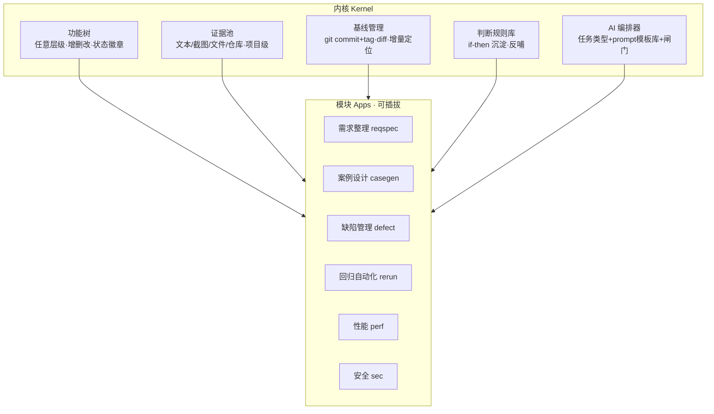

# QuOS · 总体架构

> Quality OS —— 质量操作系统。全质量域模块化集成：需求、案例、缺陷、自动化、性能、安全。为 AI 深度协作的测试流程设计；当前由单人使用（背景见 requirements.md §1），架构按可扩展设计，不设单人限制。

## 1. 核心理念

```
传统测试平台：功能的集合（用例管理 + 缺陷管理 + ...各管一摊，数据不通）
QuOS：操作系统 = 内核 + 可插拔模块（所有模块共享同一套资产与 AI 编排）
```

| 理念 | 内容 |
|---|---|
| 资产统一 | 一棵功能树贯穿全程：需求卡片挂叶子 → 案例组挂卡片 → 缺陷聚集挂模块 → 回归范围=受影响子树 |
| 文件为源 | Markdown + git 是唯一真相源，平台只是编排器和视图层；数据永不锁死 |
| AI 编排化 | 每个动作一个 AI 任务，prompt 模板即流程知识，可版本化 |
| 闸门内建 | 人工闸门（核验/判读/终审）是平台功能不是自觉 |
| 判断复利 | AI 出初稿、人做砍/补/锚，过程中把判断沉淀成 if-then 规则库反哺 AI |

## 2. 架构



### 内核资产（所有模块共用）

| 资产 | 说明 |
|---|---|
| 功能树 | 唯一导航结构；需求卡片/案例组/缺陷统计都挂节点 |
| 证据池 | 项目级材料库（代码仓库、文档、口头、截图），带可信度分治 |
| 基线 | git 版本化；任何模块产出都可存档、可 diff、可增量定位 |
| AI 编排器 | 任务注册表：extract / conflict / gap / assemble / impact / casegen / … |
| 判断规则库 | 人工判断的 if-then 显性化积累（专家经验的资产化） |

### 模块 = 六步式工作流（统一节奏）

每个质量模块都遵循同一节奏（已由 reqspec 验证）：

```
选目标节点 → AI 生成初稿 → 人工闸门（核验/砍补锚）→ 产出资产挂树 → 问人回路（按需）→ 并入基线
```

## 3. 技术栈

| 层 | 选型 | 理由 |
|---|---|---|
| 前端 | Vue 3 + Vite | 单人可维护，AI 生成效率高 |
| 后端 | Python FastAPI | LLM 生态最顺 |
| 存储 | 文件系统 + git（无数据库，SQLite 仅索引缓存） | 文件为源 |
| AI | LLM API 直连 | 每动作一任务，prompt 模板版本化 |
| 部署 | 本地单机 localhost | 一人使用，零运维 |

## 4. 目录规划

```
QuOS/
├── docs/            # 架构与模块方案
├── prototype/       # 交互原型（模块验证用）
├── server/          # FastAPI 后端（M1 起）
├── web/             # Vue3 前端（M1 起）
└── prompts/         # AI 任务 prompt 模板库（版本化，资产）
```
