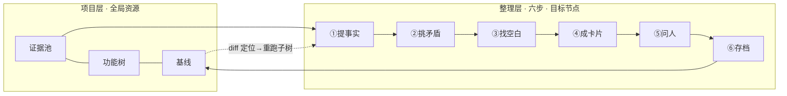

# reqspec 需求整理模块 · 设计 spec

> 日期：2026-09-23 ｜ 状态：待评审 ｜ 交互基准：`prototype/reqspec.html`（可交互原型，含一键演示）

## 1. 目的与成功标准

把碎片化输入（无文档 / 过期文档 / 开发过程文档 / AI 生成文档 / 口头）重建为**可测规格**：一棵功能树 + 叶子挂规格卡片。

**验收标准就一条：每个功能点，不看代码也能判定对错。**

成功标准（MVP）：

1. 一个真实碎片需求产出 3-5 张可用规格卡片
2. 第二次需求到来走增量：diff 定位受影响卡片，只重跑该子树
3. AI 断言全量核验错误可发现、可修正（不许静默编造进入卡片）

## 2. 两级流程



- **项目层**：证据池、功能树、基线——持续维护的全局资源，与节点无关
- **整理层**：选中一个功能点（目标节点）后走六步；导航显示「整理 · <节点名>」，点树任意节点即切换目标

## 3. 逐步设计

### ① 提事实

从证据池勾选相关材料（或现场入池新材料），AI 逐份提取**原子行为断言**。

**断言规范**：

```
格式：当 [触发条件]，[系统/组件] 应 [可观察行为]
✗ "支持重试"（碎片，不可判定）
✓ "当放款回调超时 30s，重试服务应以相同流水号重发，上限 3 次"
```

**强制要求**：每条断言带出处（`文件:行号` / `文档§节` / `口头·日期`）——出处是置信度与后续裁决的根基。

**置信度分级**：代码实证（绿）/ 文档（蓝）/ 推测 ⚠（琥珀）/ AI 待实证（红，AI 材料产出强制打此级）/ 旧文档（灰）。

**核验机制（全量 + 指定，不抽样）**：

| 方式 | 行为 |
|---|---|
| AI 全量核验 | 每条断言逐条比对源码，读错的当场标黄修正（如「固定 60s → 实为指数退避」），输出核验记录 |
| 单点核验 | 断言表任意行点「核」，单独核验该条 |

闸门：全量核验未通过的断言不得进入卡片（原型中为统计提示，实现中为硬阻断）。

### ② 挑矛盾

检测**所有材料之间**的互斥（不止文档内部）：代码 vs 文档、代码 vs 口头、文档 vs 文档。

- 冲突对左右对照展示（双方断言 + 出处 + 类型）
- 每对三选一裁决：**信 A / 信 B / 转问人**；被否决方断言划线作废
- **裁决规则内建**：代码 vs 文档默认倾向代码（实然）；「代码与口头意图相反」= 疑似生产 bug，**强制转问人，禁止自动裁决**

### ③ 找空白

按**可配置维度清单**（项目级规则库）逐节点扫描「没人说清楚的地方」——文档没写、代码看不出意图、口头没提。

- 预置六维：状态 / 异常 / 边界 / 幂等 / 数据 / 依赖；可增删（如金融加「审计留痕」「监管报送」）
- 每条空白两处置：**转问人** / **判读为设计如此**（留痕关闭）
- 空白 ≠ 缺陷，判读权在人

### ④ 成卡片

断言挂到目标节点，聚合成规格卡片（AI 组装草稿）。

**卡片字段**：

```
功能点 / 业务目标（1行）/ 变更属性（本次修改·高/中/低）/ 入口触发 /
主流程（步骤化）/ 规则（R# 编号 + 内容 + 出处 + 置信度徽章）/
状态机 / 异常边界（关联空白数）/ 补充说明（人工意见）/ 依赖 / 未确认项
```

- **R# 编号是灵魂**：案例追溯（C↔R）和取舍推理的锚点
- **补充意见重新生成**：组装/重新生成弹窗输入人工意见（AI 不知道的口头约定、历史坑、业务约束），并入卡片「补充说明」并影响规则
- 挂不上的断言 = 树缺枝 → 补枝提示
- **结果文档**：整棵树 + 卡片 → 自动导出 markdown 结构化需求规格（可复制/下载）；文档永远是生成物，不手工编辑

### ⑤ 问人

待问项合并（矛盾转来 + 推测断言 + 空白转来），**攒批一次问，给选择题不给问答题**。

- 导出提问文本（带出处 + 选项，复制发 IM）：`1. 重试上限是 3 还是 5？（代码 retry.py:42 写 3，设计文档§2 写 5）`
- 答案回收：记录选项（口头答案 = 推测级）→ 关键项**落码验证** → 置信度升级实证

### ⑥ 存档

本节点卡片并入项目基线（git commit + tag）。存档前显示待确认项汇总。节点树徽章更新。

## 4. 数据模型与文件布局

```
Project（如 风控云）
 └─ tree.md                    功能树（任意层级嵌套）
 └─ cards/<节点>.md             规格卡片（R# 规则、断言出处、置信度、补充说明）
 └─ evidence/                   证据池（原始材料、转录、仓库登记）
 └─ clarifications.md           问人清单（问题/选项/出处/状态）
 └─ baselines/（= git tag）      基线快照
对象：Evidence(id,name,type,stars,reg,state,count) ·
     Assertion(id,text,src,conf,st,verified) ·
     Conflict(a,b,q,st,resolution) ·
     Gap(dim,text,st) ·
     Clarification(no,q,opts,st,answer,ref) ·
     Baseline(v,commit,date,note)
```

## 5. AI 任务清单

| 任务 | 输入 | 输出 | 闸门 |
|---|---|---|---|
| extract | 材料（文本/代码/文档解析结果） | 断言[]（内容+出处+置信度初判） | 全量核验；单点核验 |
| conflict | 断言全集 | 冲突对[]（引双方出处） | 人工逐对裁决；反向冲突强制转问人 |
| gap | 卡片 + 维度配置 | 空白[]（维度+描述） | 人工判读 |
| assemble | 断言 + 树 + 人工意见 | 卡片草稿（含置信度） | 人工调树终审 |
| clarify-gen | 矛盾+推测+空白 | 提问文本（选择题+出处） | 直接发 IM |
| impact | git diff + 基线树 | 受影响卡片[] | 人工过目再重跑 |

prompt 模板存 `prompts/`，git 版本化——改 prompt = 改流程。

## 6. 错误与边界处理

| 场景 | 处理 |
|---|---|
| AI 断言编造 | 全量核验标黄修正；核验记录可追溯；未核验断言不进卡片 |
| AI 材料幻觉 | AI 生成文档产出的断言强制「待实证」，逐条核实后才升级 |
| 证据先天缺失 | 口头/截图先入池不丢失；无文档时代码逆向为主源 |
| 冲突裁决后新材料推翻裁决 | 断言不作废只划线；重新提取可复活 |
| 问人无人答 | 待确认项保留在卡片黄条与基线备注中，风险显式化不隐藏 |
| 增量定位漏 | 定位结果人工过目才触发重跑；漏检风险由基线 diff 复核兜底 |
| 补充意见与断言冲突 | 意见进「补充说明」+ 触发新矛盾检测，不静默覆盖 |

## 7. 测试策略

- 模块单测：断言解析、冲突配对、维度扫描、C↔R 映射
- AI 任务验收：用固定样本材料跑 prompt，断言错误率、冲突召回作为回归指标（prompt 改动的护栏）
- MVP 端到端验收：见 §1 成功标准，用真实碎片需求走完六步 + 增量第二单

## 8. 交互基准

`prototype/reqspec.html` 为交互与视觉基准（已验证：智能输入自动识别、全量核验动画、可配维度、任意层级树增删改徽章、冲突裁决三选、意见重生成、结果文档导出、增量定位演示）。实现时以此为准，偏差需在此 spec 记录原因。
